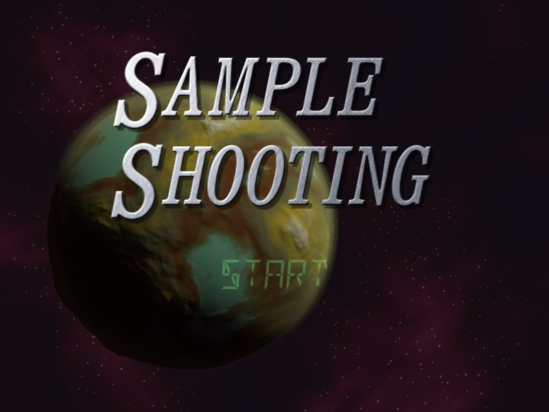
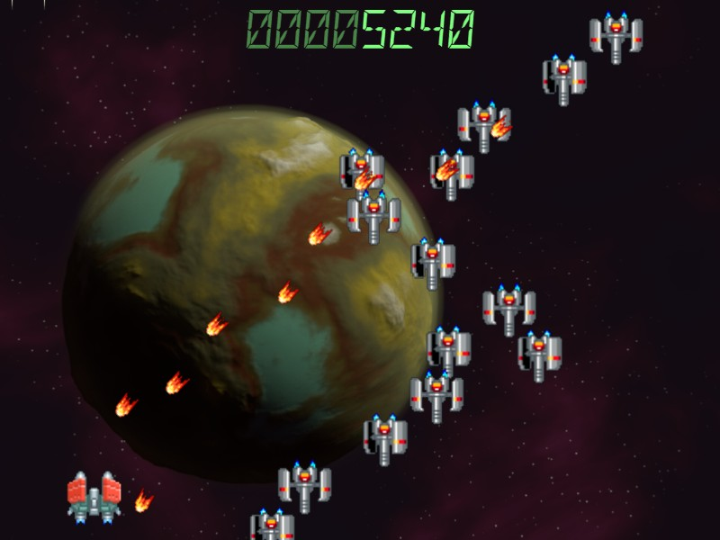
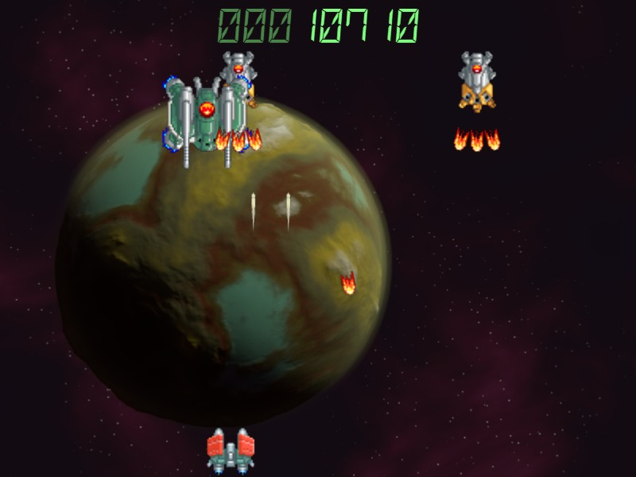
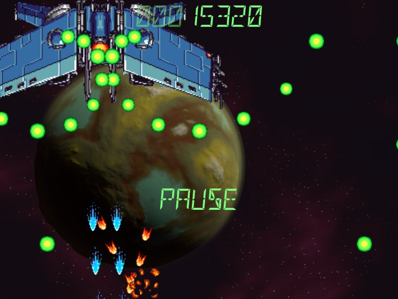

#2D Shooting Game by DirectX 12

某所の「DirectX 12による2Dゲーム作成」講義に使った資料置き場です。  
ウィンドウの作成から始めて、少しずつゲームの部品を実装していきます。 

ソースコードは資料のコードそのままではないです。
各ドキュメントの最後にある「やってみよう」の項目を実装し、回によってはさらにいくつかの機能を追加しています。

##ビルド環境
- Windows 10 Anniversary Update
- Microsoft Visual Studio 2015 Community Edition
- Microsoft Windows SDK 10.0.14393.0

おかしなところを見つけたらPull-Requestください。

##スクリーンショット

